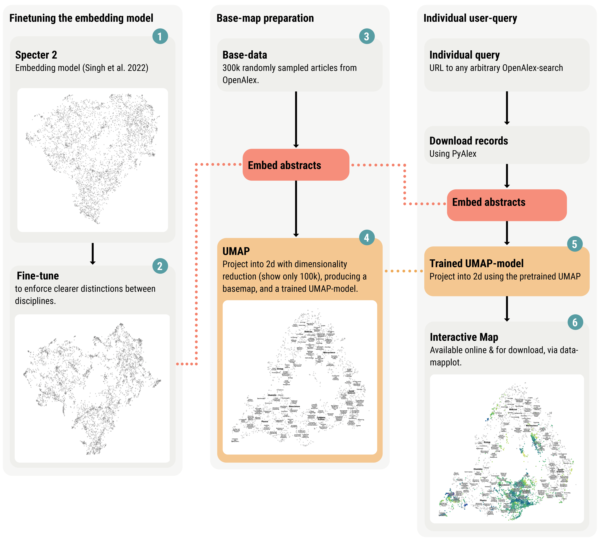

# The Philosopher's Guide to Language Modeling {layout="title" data-gp-kicker="BOCHUM / LLMs & PHILOSOPHY" data-gp-code="The Philosopher's Guide to Language Modeling" data-gp-section="Title"}

::: {.gp-meta-grid}
::: {.gp-block}
Speaker Max Noichl
:::
::: {.gp-block}
Institution Utrecht University
:::
::: {.gp-block}
Date Bochum, 24 July 2026
:::
:::

# Follow along on your device {layout="bullets" .gp-link-slide data-gp-section="Follow Along"}

::: {.gp-link-panel}
Live slides

[tinyurl.com/llm-bochum](https://tinyurl.com/llm-bochum){.gp-primary-link}

[mnoichl.github.io/language-modeling-for-philosophers-bochum-2026](https://mnoichl.github.io/language-modeling-for-philosophers-bochum-2026/){.gp-url}
:::

# Route {layout="outline" data-gp-section="Route"}

* Terminology
* Bag of words
* Topic models
* Word embeddings
* Transformers
* Building an atlas of the sciences.
* What drives progress in philosophy?

# Terminology (Sloppy) {layout="bullets" .gp-compact-glossary data-gp-section="Intro"}

* **Model:** A mathematical structure, implemented with computer code, intended to represent something.
* **Fitting / training / learning:** Jiggling around the numbers in a model until it predicts well. [XKCD](#){.opens-modal data-modal-type="image" data-modal-url="https://imgs.xkcd.com/comics/machine_learning_2x.png" data-modal-navblock="true"}
* **Prediction:** Passing data to a model and seeing what it does with it. We're often predicting the past.
* **Supervised / unsupervised / semi-supervised:** In supervised learning we have labeled data that we learn to predict; in unsupervised learning we do not; in semi-supervised learning, we make up the labels on the go.
* **Matrix:** A grid of numbers, like an Excel table.

# Why Model Language? {layout="bullets" data-gp-section="Intro"}

* Models enable computational analysis.
* Computational analysis enables large-scale investigation.
* It can sometimes increase objectivity.
* It also leads, strangely, leads to general intelligence.

<!-- # Bag Of Words {layout="divider" data-gp-kicker="Section / 02" data-gp-section="Bag of Words"} -->

# Bag Of Words {layout="bullets" data-gp-section="Bag of Words"}

* The simplest language model.
* We just count the words! [BOW](#){.opens-modal data-modal-type="image" data-modal-url="images/bow_ideogram.jpeg" data-modal-navblock="true"}.
* This gives us a numerical representation of a text.
* It also throws away most of what philosophers care about.

<!-- # Topic Models {layout="divider" data-gp-kicker="Section / 03" data-gp-section="Topic Models"} -->

# Topic Models {layout="bullets" data-gp-section="Topic Models"}

* Bag-of-words does not tell us much by itself.
* But we can look for the hidden structures. [TM](#){.opens-modal data-modal-type="image" data-modal-url="images/topic_modelling_better.png" data-modal-navblock="true"} generating bags of words.
* Topic models try to explain documents as mixtures of latent themes.
* These structures are still only matrices. [Matrix](#){.opens-modal data-modal-type="image" data-modal-url="images/topic_matrices_better.jpg" data-modal-navblock="true"}.

# {layout="exhibit" .gp-exhibit-xl data-gp-section="Topic Models"}

<iframe src="images/malaterre_2020.pdf" title="Malaterre 2020 paper"></iframe>

::: {.gp-embed-fallback}
[Open Malaterre 2020](images/malaterre_2020.pdf)
:::

# {layout="exhibit" .gp-exhibit-xl data-gp-section="Topic Models"}

<iframe src="images/barron-et-al-individuals-institutions-and-innovation-in-the-debates-of-the-french-revolution.pdf" title="Barron et al. paper"></iframe>

::: {.gp-embed-fallback}
[Open Barron et al.](images/barron-et-al-individuals-institutions-and-innovation-in-the-debates-of-the-french-revolution.pdf)
:::

# {layout="exhibit" .gp-exhibit-xl data-gp-section="Topic Models"}

<iframe src="images/jing-et-al-sameness-entices-novelty-enchants-2025.pdf" title="Jing et al. 2025 paper"></iframe>

::: {.gp-embed-fallback}
[Open Jing et al. 2025](images/jing-et-al-sameness-entices-novelty-enchants-2025.pdf)
:::

# Topic Models, Limits {layout="bullets" data-gp-section="Topic Models"}

* Topic models are the hammer of language modeling.[Mallet](#){.opens-modal data-modal-type="iframe" data-modal-url="http://mallet.cs.umass.edu" data-modal-navblock="true"}
* They are not great for everything.
* But their failure modes are comparatively well known.

<!-- # Word Vectors {layout="divider" data-gp-kicker="Section / 04" data-gp-section="Word Vectors"} -->

# Word Vectors {layout="bullets" data-gp-section="Word Vectors"}

* Topic models and bags-of-words are blunt.
* They do not account for semantics.
* Wittgenstein: "Die Bedeutung eines Wortes ist sein Gebrauch in der Sprache." (PU, §43)
* So let us estimate semantics from contexts. [Skip-gram](#){.opens-modal data-modal-type="image" data-modal-url="images/skipgram_network.png" data-modal-navblock="true"}

# Word Vectors, Continued {layout="bullets" data-gp-section="Word Vectors"}

* We can estimate semantics from contexts.
* And then we can do math with words.

# {layout="exhibit" .gp-exhibit-xl data-gp-section="Word Vectors"}

<iframe data-src="https://vectors.nlpl.eu/explore/embeddings/en/calculator/" title="Word vectors calculator"></iframe>

::: {.gp-embed-fallback}
[Open the vector calculator](https://vectors.nlpl.eu/explore/embeddings/en/calculator/)
:::

<!-- # Transformers {layout="divider" data-gp-kicker="Section / 05" data-gp-section="Transformers"} -->

# Transformers {layout="bullets" data-gp-section="Transformers"}

* Problem: meaning is context-sensitive.
* We can update the representations of a word based on its context.
* Attention is all you need!

# {layout="exhibit" .gp-exhibit-xl data-gp-section="Transformers"}

<iframe data-src="https://arxiv.org/pdf/1706.03762" title="Attention Is All You Need paper"></iframe>

::: {.gp-embed-fallback}
[Open Attention Is All You Need](https://arxiv.org/pdf/1706.03762)
:::

# {layout="exhibit" .gp-exhibit-xl data-gp-section="Transformers"}

<iframe data-src="https://poloclub.github.io/transformer-explainer/" title="Transformer Explainer"></iframe>

::: {.gp-embed-fallback}
[Open the Transformer Explainer](https://poloclub.github.io/transformer-explainer/)
:::

# BERTs And GPTs {layout="bullets" data-gp-section="Transformers"}

* BERT and GPTs use the same basic machinery.
* **BERT:** bidirectional encoder representations from transformers.
* **Purpose of BERT:** embeddings and fast language tasks, like keyword-extraction. [SOPHIS](#){.opens-modal data-modal-type="iframe" data-modal-url="images/petrovich-et-al-sophis-2026.pdf" data-modal-navblock="true"}
* **GPTs:** decoder-only transformers.
* GPTs predict only ahead & generate text.

# "Real" LLM's {layout="bullets" data-gp-section="Transformers"}

* Make the model huge, train in on everything (you can find).
* Train it on reasoning chains & problem solving.
* It is still just next-token prediction.
* Stochastic parrots?

# {layout="exhibit" .gp-exhibit-xl data-gp-section="Transformers"}

<iframe src="images/stochastic_parrots.pdf" title="Stochastic Parrots paper"></iframe>

::: {.gp-embed-fallback}
[Open Stochastic Parrots](images/stochastic_parrots.pdf)
:::

# "Real" LLMs {layout="bullets" data-gp-section="Transformers"}

* Next-token prediction is surprisingly powerful.
* Sutskever's example: how do you predict the final word of a detective novel?
* You have to figure out who the culprit is.
* That suggests the model has learned something like a world model.
* "Platonic" representations?

# {layout="exhibit" .gp-exhibit-xl data-gp-section="Transformers"}

<iframe src="images/gurnee_tegmark_2024.pdf" title="Gurnee and Tegmark 2024 paper"></iframe>

::: {.gp-embed-fallback}
[Open Gurnee and Tegmark 2024](images/gurnee_tegmark_2024.pdf)
:::

# OA Atlas {layout="exhibit" .oa-atlas-map-slide data-gp-section="OA Atlas" data-gp-caption="Workflow of OA Atlas (with Andrea Loettgers and Tarja Knuuttila)."}

<figure class="gp-figure oa-atlas-map-figure">

</figure>

::: aside
@singhSciRepEvalMultiFormatBenchmark2023; @mcinnesUMAPUniformManifold2018; @debruinPyAlex2023
:::

# {layout="exhibit" .gp-exhibit-xl data-gp-section="OA Atlas"}

<iframe data-src="https://huggingface.co/spaces/MaxNoichl/oa-atlas/embed" title="OA Atlas"></iframe>

::: {.gp-embed-fallback}
[Open OA Atlas](https://huggingface.co/spaces/MaxNoichl/oa-atlas)
:::

# Model Templates {layout="exhibit" .oa-atlas-result-slide data-gp-section="OA Atlas" data-gp-caption="Debates about model transfer in science; model templates as a structuring principle orthogonal to disciplines."}

<figure class="gp-figure oa-atlas-result-figure">

</figure>

::: aside
@humphreysExtendingOurselvesComputational2004; @knuuttilaModelTemplatesTransdisciplinary2023
:::

# Concepts {layout="exhibit" .oa-atlas-result-slide data-gp-section="OA Atlas" data-gp-caption="Distribution of concepts over large, interdisciplinary samples."}

<figure class="gp-figure oa-atlas-result-figure">

</figure>

::: aside
@malaterreRecipesPhilosophyScience2020; @zichertTracingDevelopmentVirtual2024
:::

# Attention of HPS {layout="exhibit" .oa-atlas-result-slide data-gp-section="OA Atlas" data-gp-caption="500k sources from the history and philosophy of science literature."}

<figure class="gp-figure oa-atlas-result-figure">

</figure>

::: aside
@weingartFindingHistoryPhilosophy2015
:::

<!--

<!-- # Philosophical Progress {layout="divider" data-gp-kicker="Intermezzo / 02" data-gp-section="Philosophical Progress"}--->

# Philosophical Progress {layout="bullets" data-gp-section="Philosophical Progress"}

* With Simon DeDeo (CMU, SFI).
* Two modes of philosophical reasoning:
    * Rigorous: propositions, arguments, positions.
    * Fluid: examples, metaphors, pictures, intuitions.
* Corpus of 23k philosophy texts.
* Parse with GPT-4o into examples and positions.
* Merge: first embed with a BERT-style model, then detect nearest neighbours, then ask GPT-4o whether these are the same. [Merge](#){.opens-modal data-modal-type="iframe" data-modal-url="images/workflow_overview.pdf" data-modal-navblock="true"}

# Philosophical Progress, Continued {layout="bullets" data-gp-section="Philosophical Progress"}

* Positions are more dynamic, examples temporally stable. [Rise and Fall](#){.opens-modal data-modal-type="image" data-modal-url="images/rise_and_fall.png" data-modal-navblock="true"}
* Examples form long range connections, positions structure locally. [Network analysis](#){.opens-modal data-modal-type="iframe" data-modal-url="images/Large_network_full_v5.pdf" data-modal-navblock="true"}
* Citations: Novel example combinations increase success.

# Continue with the notebook {layout="bullets" .gp-link-slide data-gp-section="Notebook"}

::: {.gp-link-panel}
Google Colab

[Open the text-analysis workbook](https://colab.research.google.com/github/MNoichl/language-modeling-for-philosophers-bochum-2026/blob/main/notebooks/workbook_01_text_analysis.ipynb){.gp-primary-link}

Run the examples, change the code, and save your own copy.
:::

# Literature {layout="references" data-gp-section="References"}
